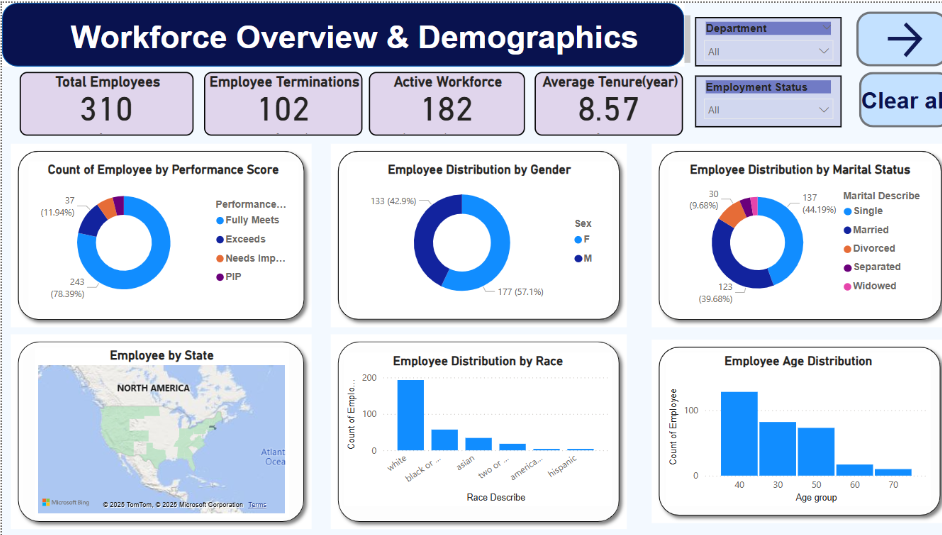
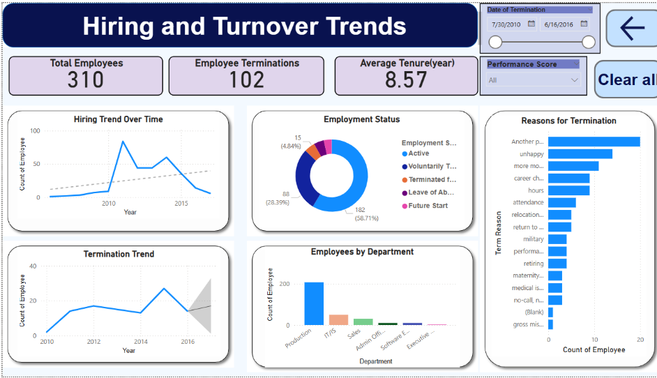

#  Workforce Analytics Dashboard (Power BI)

##  Overview
This project is an interactive Power BI dashboard built to analyze workforce data and generate key HR insights. It focuses on employee demographics, performance, hiring patterns, and turnover trends to support effective workforce planning.

---

##  Objective
- Analyze employee demographics and distribution  
- Evaluate performance across different groups  
- Identify hiring and turnover trends  
- Support HR decision-making with data-driven insights  

---

##  Tools & Technologies
- Power BI  
- Microsoft Excel  
- DAX  

---

##  Dashboard Preview

---

##  Key Visuals:
- Employee distribution by performance, gender, age, race, and marital status
- Employee distribution by performance, gender, age, race, and marital status
- Hiring and termination trends over time 
- Employment status breakdown
- Top reasons for employee turnover 
- Department-wise employee count 

---

##  Conclusion
This dashboard provides valuable insights into workforce structure, employee performance, and turnover patterns, helping organizations improve HR strategies and employee retention.

---

